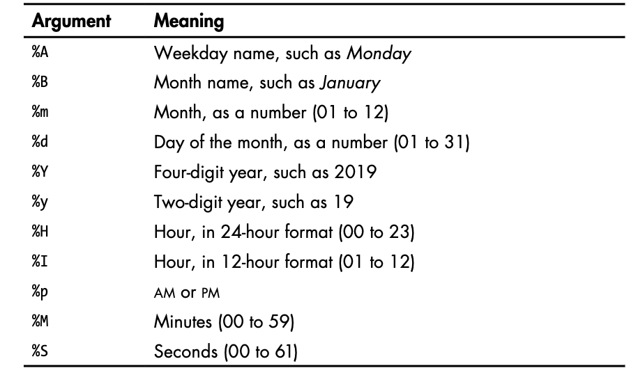

## TODO

- install Matplotlib
```
python -m pip install matplotlib
```

### Random walks
- a random walk is a path that has no clear direction but is determined by a series of random decisions,
    each of which is left entirely to chance.

## Rolling Dice with Plottly
- install Plotly
```
 python -m pip install plotly
```

## Datetime formating arguments from the datetime module


